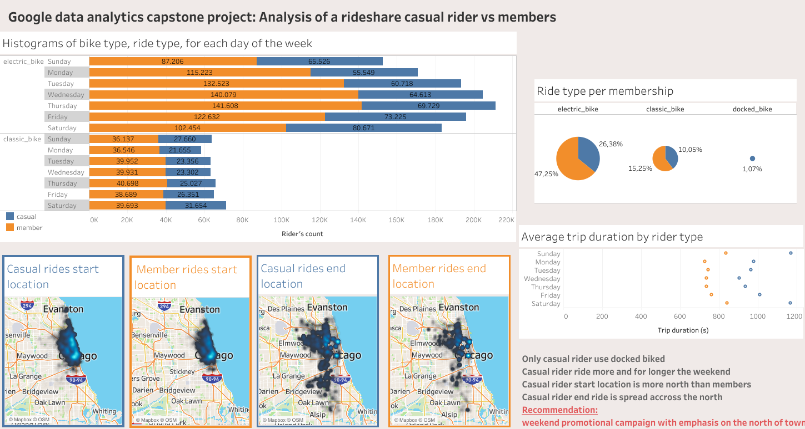

# r-capstone-project
This repository collects the code for my capstone project for the [google data analytics professional certificate](https://coursera.org/share/1bdc6fafbe4a41a46f12745f24a5508c)

# Contents:
* Capstone_project.ipynb: an Rmarkdown notebook that is used to download and clean the data with a link to a Tableau dashboard at the end
* Capstone_project.html: the html version of the markdown project

# Scenario
As a junior data analyst working on the marketing analyst team at Cyclistic, a bike-share
company in Chicago. 

The director of marketing believes the company’s future success
depends onmaximizing the number of annual memberships. Therefore, your team wants to
understand how casual riders and annual members use Cyclistic bikes di erently. From these
insights, your team wi l design a new marketing strategy to convert casual riders into annual
members. But rst, Cyclistic executives must approve your recommendations, so they must be
backed upwith compeling data insights and professional data visualizations.

# Solution

1. Download the data
  I have created a function that reads an url download the file and unzip the downloaded file
2. Cleanning and prepare data for analysis
   Removed unconsistency in the data created a column trip duration
3. Preformed some descriptive analysis
  I looked at the number of rides by rider type
4. Export data to Taleau
5. Creation of a Tableau dashboard

